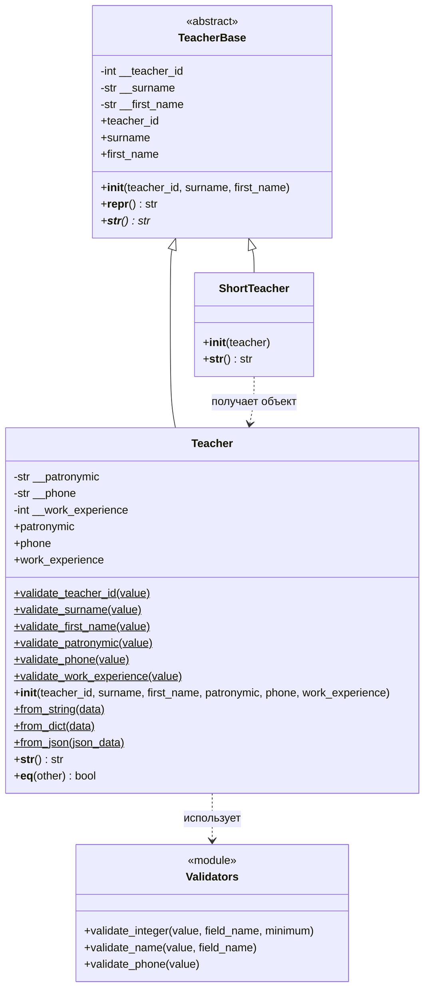

# Диаграмма классов UML

```mermaid
classDiagram
    class TeacherBase {
        <<abstract>>
        -int __teacher_id
        -str __surname
        -str __first_name
        +__init__(teacher_id, surname, first_name)
        +teacher_id
        +surname
        +first_name
        +__repr__() str
        +__str__()* str
    }

    class Teacher {
        -str __patronymic
        -str __phone
        -int __work_experience
        +validate_teacher_id(value)$
        +validate_surname(value)$
        +validate_first_name(value)$
        +validate_patronymic(value)$
        +validate_phone(value)$
        +validate_work_experience(value)$
        +__init__(teacher_id, surname, first_name, patronymic, phone, work_experience)
        +from_string(data)$
        +from_dict(data)$
        +from_json(json_data)$
        +patronymic
        +phone
        +work_experience
        +__str__() str
        +__eq__(other) bool
    }

    class ShortTeacher {
        +__init__(teacher)
        +__str__() str
    }

    class Validators {
        <<module>>
        +validate_integer(value, field_name, minimum)
        +validate_name(value, field_name)
        +validate_phone(value)
    }

    TeacherBase <|-- Teacher
    TeacherBase <|-- ShortTeacher
    Teacher ..> Validators : использует
    ShortTeacher ..> Teacher : получает объект
```
